# 🏗️ SDLC Chatbot Architecture Diagrams

This document provides visual representations of the system architecture, data flow, and component relationships to help developers understand the codebase from scratch.

## 📊 Entity Relationship Diagram

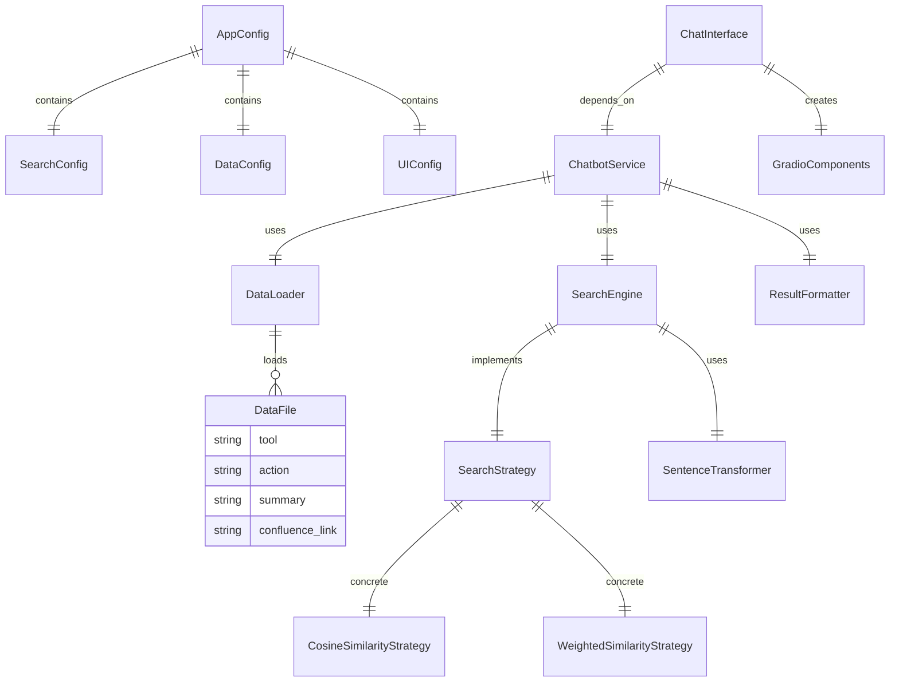

## 🔄 Code Property Graph - Component Dependencies

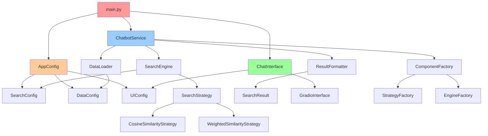

## 🚀 Application Bootup Flow

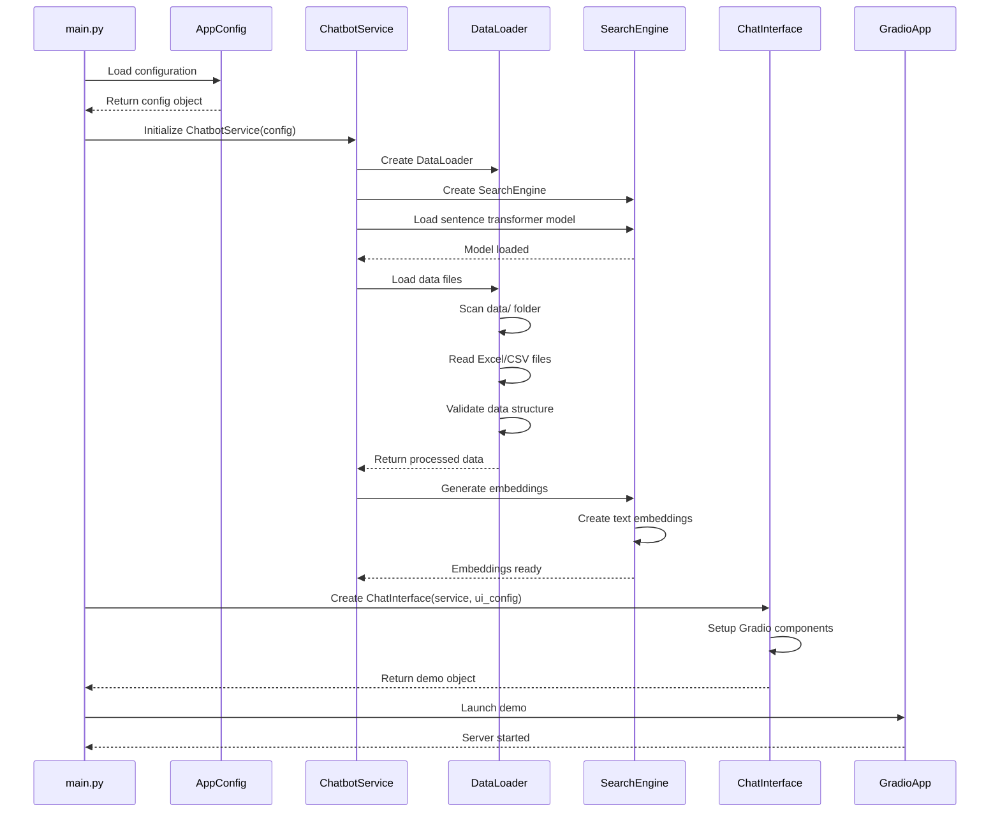

## 🔍 Search Operation Flow

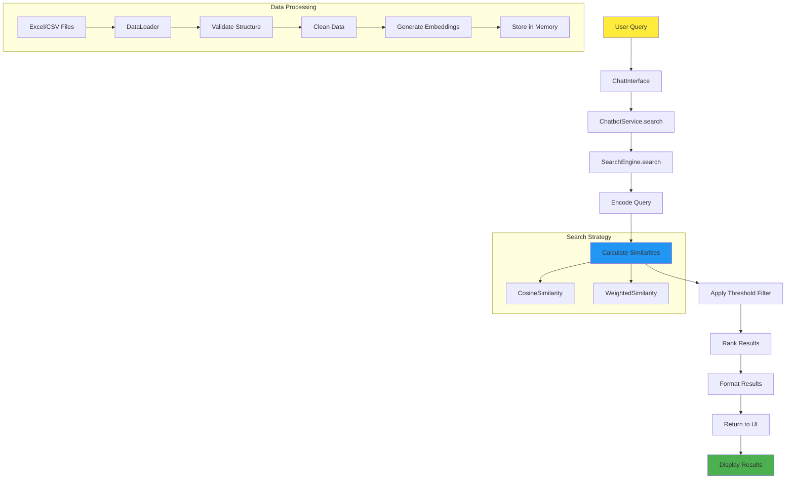

## 🏭 Factory Pattern Implementation

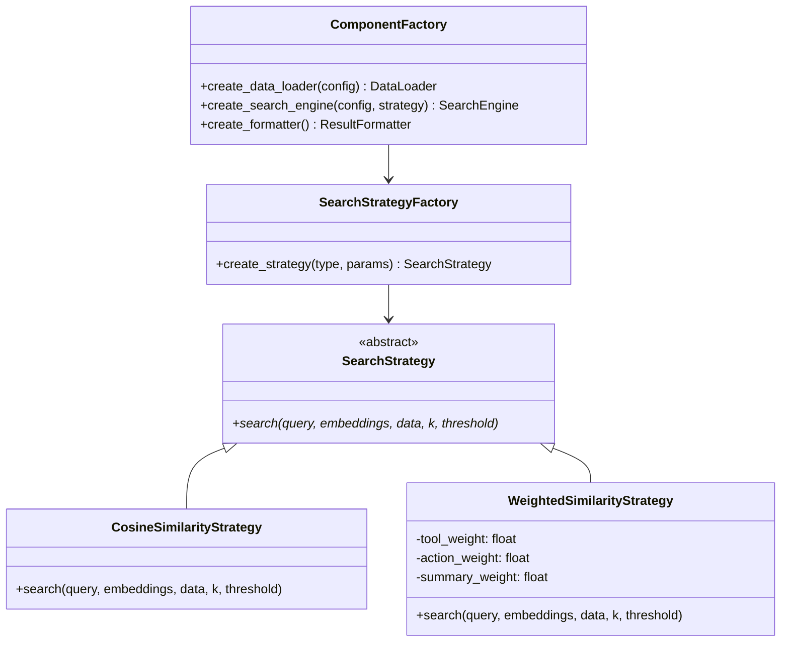

## 📁 Data Flow Architecture

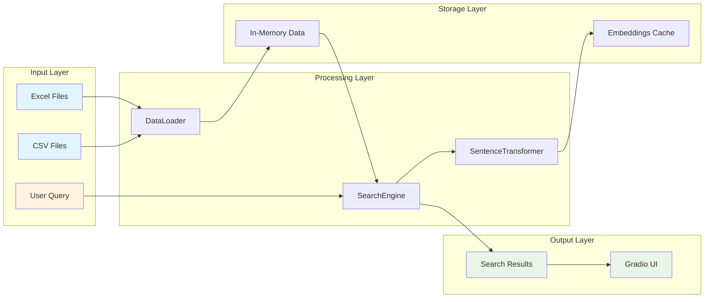

## 🔧 Configuration Hierarchy

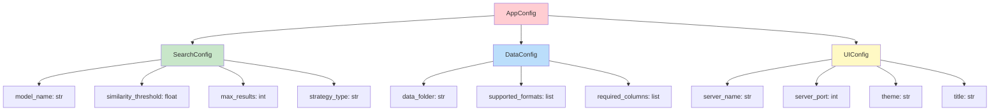

## 🎯 Component Interaction Matrix

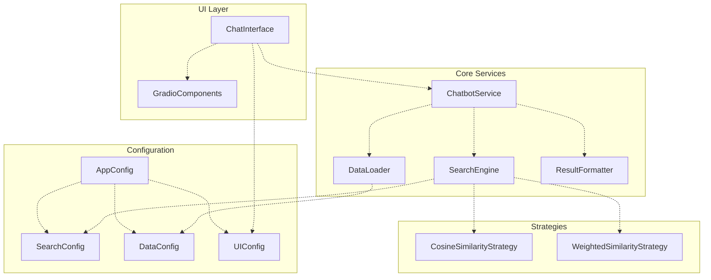

## 🚦 Error Handling Flow

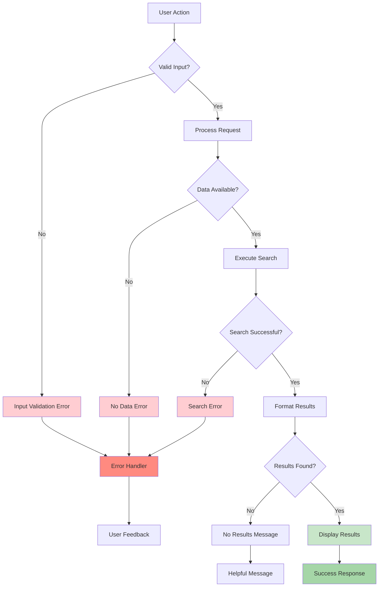

## 📈 Performance Monitoring Points

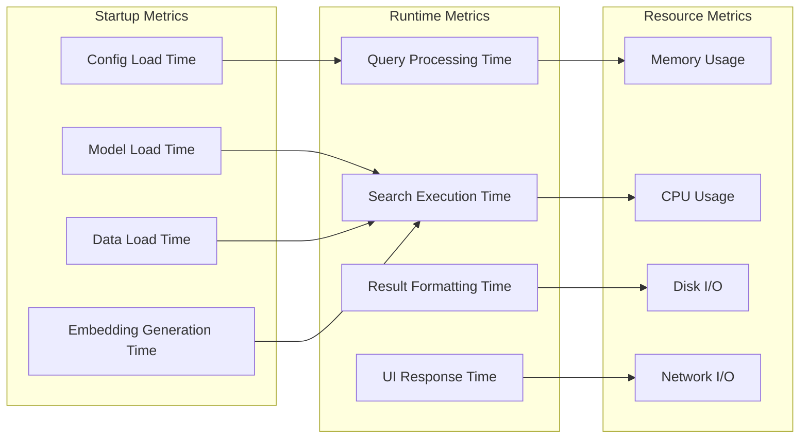

## 🔄 State Management

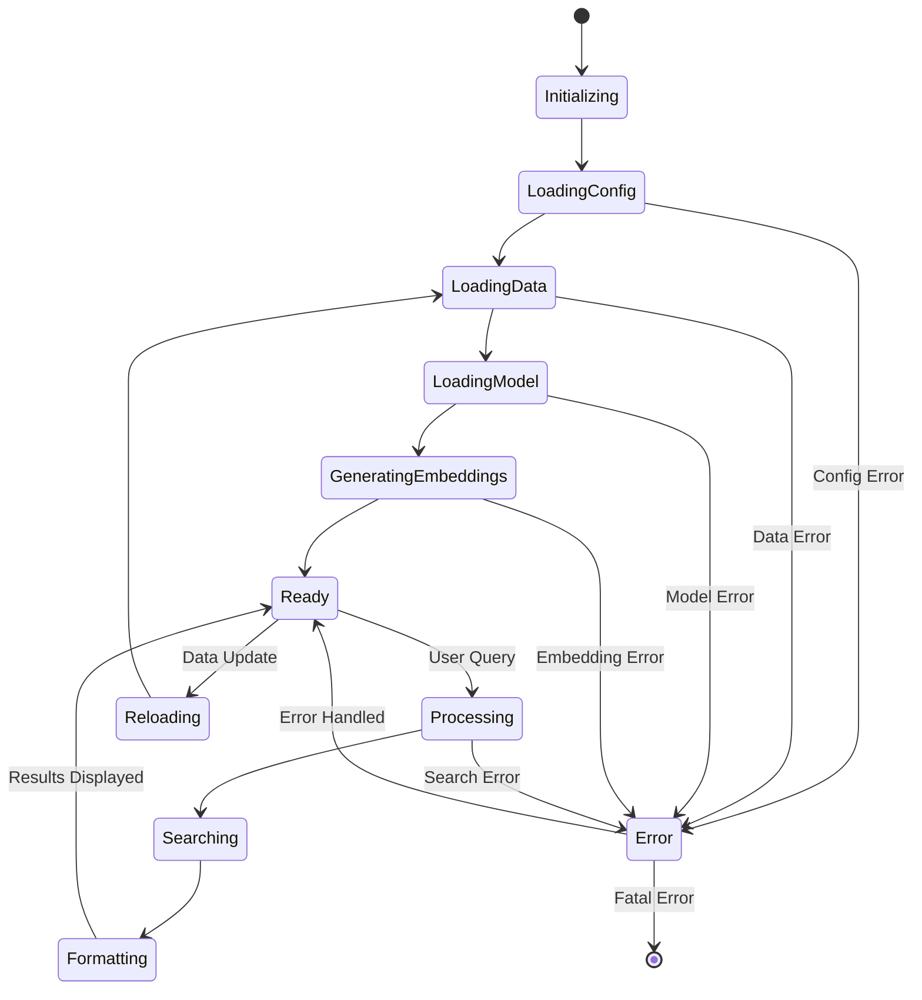

## 🎨 UI Component Structure

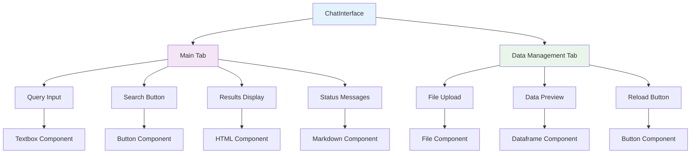

## 🔍 Key Takeaways for Developers

### 1. **Modular Architecture**
- Each component has a single responsibility
- Dependencies are injected through constructors
- Configuration is centralized and type-safe

### 2. **Data Flow**
- Data flows unidirectionally from input to output
- Transformations happen at clear boundaries
- State is managed explicitly

### 3. **Extension Points**
- New search strategies can be added via the Strategy pattern
- UI components are modular and replaceable
- Configuration supports environment-specific overrides

### 4. **Error Handling**
- Errors are caught at component boundaries
- User feedback is provided for all error states
- System gracefully degrades when components fail

### 5. **Performance Considerations**
- Models are loaded once at startup
- Embeddings are cached in memory
- Search operations are optimized for speed

This architecture ensures the system is maintainable, testable, and extensible while providing a smooth user experience.